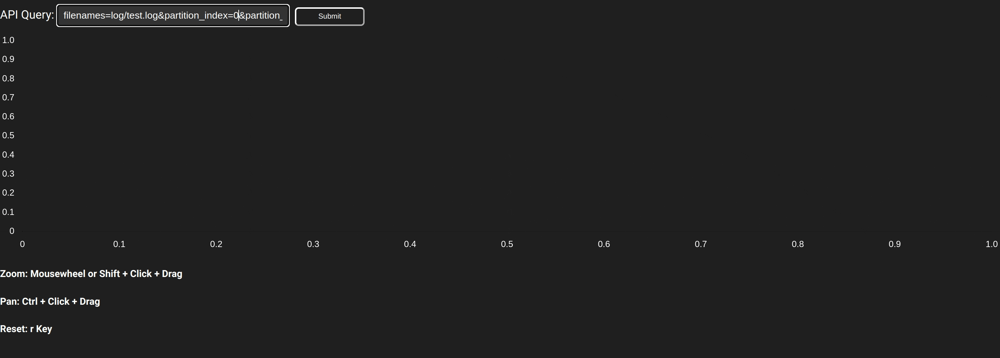

# logsplorer

This is a visualisation app with logs querying functionality to quickly search through and view JSON log outputs from stochadex simulations.

## Building and running the logs explorer and visualisation app

```shell
# install the dependencies for and build the visualisation app
cd ./app && npm install && npm run build && cd ..

# build the binary
go build -o bin/ ./cmd/logsplorer

# run the app and checkout http://localhost:3000
./bin/logsplorer --config ./cfg/logsplorer_config.yaml
```



## Building and running the Docker container (may need sudo)

```shell
# build the logsplorer container
docker build --tag logsplorer .

# run the binary in the container with your config
docker run -p 8080:8080 logsplorer --config ./cfg/logsplorer_config.yaml
```
